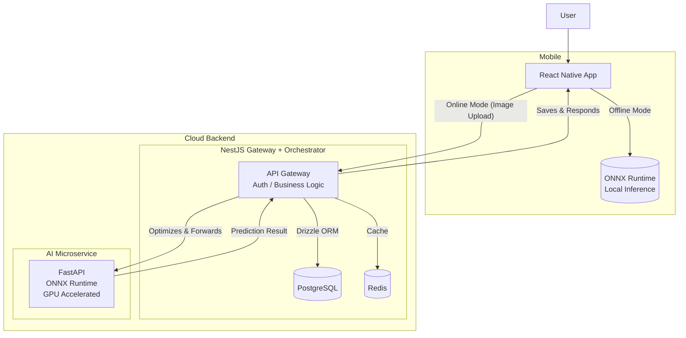

<p align="center">
  
  <h1 align="center">🌾 Crop-AI</h1>
  <p align="center">
    <strong>Intelligent Crop Disease Detection</strong><br />
    Offline-first mobile AI powered by ONNX Runtime & a scalable microservices backend.
  </p>
</p>

<p align="center">
  <a href="#-tech-stack"></a>
  <a href="#-tech-stack"></a>
  <a href="#-tech-stack"></a>
  <a href="#-tech-stack"></a>
  <a href="#-tech-stack"></a>
  <a href="#-tech-stack"></a>
  <a href="#-tech-stack"></a>
</p>

---

## 📖 Table of Contents

- [Overview](#-overview)
- [Key Features](#-key-features)
- [System Architecture](#-system-architecture)
- [Tech Stack](#-tech-stack)
- [Repository Structure](#-repository-structure)
- [Prerequisites](#-prerequisites)
- [Getting Started](#-getting-started)
  - [1. Clone the Repository](#1-clone-the-repository)
  - [2. Environment Variables](#2-environment-variables)
  - [3. Run Infrastructure with Docker](#3-run-infrastructure-with-docker)
  - [4. Database Migrations](#4-database-migrations)
  - [5. Start Development Servers](#5-start-development-servers)
  - [6. Run the Mobile App](#6-run-the-mobile-app)
- [API Endpoints](#-api-endpoints)
- [Contributing](#-contributing)
- [License](#-license)

---

## 🧠 Overview

**Crop-AI** is a full-stack, AI-powered mobile application that helps farmers detect crop diseases instantly. It leverages **ONNX Runtime** for on-device inference (offline mode) and a GPU-accelerated **Python FastAPI** service for heavy cloud-based analysis.

The backend is built with **NestJS** (Node.js) orchestrating the business logic, authentication, and image optimization, while **Drizzle ORM** provides a type-safe SQL layer over **PostgreSQL**. The entire stack runs seamlessly via **Docker Compose** for rapid local development.

---

## ✨ Key Features

| Feature                   | Description                                                                                                                      |
| :------------------------ | :------------------------------------------------------------------------------------------------------------------------------- |
| **🚀 Offline AI**         | Runs quantized ONNX models directly on the device using `onnxruntime-react-native`. No internet required for basic detection.    |
| **☁️ Cloud AI**           | Uploads images to the backend where a Python service runs full-precision models on GPU for higher accuracy and detailed reports. |
| **🔐 Authentication**     | Secure JWT-based authentication with user registration and login.                                                                |
| **📊 Historical Records** | Saves every analysis to PostgreSQL, allowing users to track disease patterns over time.                                          |
| **🖼️ Image Optimization** | Express/NestJS middleware compresses and resizes images (`sharp`) to reduce bandwidth and inference latency.                     |
| **🏗️ Modular Monorepo**   | Shared TypeScript interfaces across the mobile app and backend ensure type safety end-to-end.                                    |

---

## 🏗️ System Architecture



---

## 🛠️ Tech Stack

| Layer                 | Technology              | Version |
| :-------------------- | :---------------------- | :------ |
| **Frontend (Mobile)** | React Native (Expo/CLI) | 0.76+   |
| **Backend Framework** | NestJS (TypeScript)     | 10.x    |
| **ORM**               | Drizzle ORM             | 0.30+   |
| **Database**          | PostgreSQL              | 16      |
| **Cache**             | Redis                   | 7       |
| **AI Framework**      | FastAPI + ONNX Runtime  | 1.20+   |
| **AI Language**       | Python                  | 3.12    |
| **Containerization**  | Docker & Docker Compose | Latest  |
| **Package Manager**   | npm (Workspaces)        | 10.x    |

---

## 📁 Repository Structure

```
crop-ai-monorepo/
├── .github/workflows/        # CI/CD pipelines
├── apps/
│   ├── backend/              # NestJS API (TypeScript)
│   │   ├── src/              # Modules, Controllers, Services
│   │   ├── drizzle/          # Migration files
│   │   └── Dockerfile
│   ├── ai-service/           # Python FastAPI (ONNX)
│   │   ├── app/              # main.py, model.py, preprocessing.py
│   │   ├── models/           # crop-disease.onnx
│   │   └── Dockerfile
│   └── mobile/               # React Native App
│       ├── src/              # Screens, Components, Services
│       ├── assets/models/    # Quantized ONNX for mobile
│       └── package.json
├── packages/
│   └── shared-types/         # TypeScript interfaces (IUser, IAnalysis, etc.)
├── docker-compose.yml        # Runs Postgres, Redis, Python, NestJS
├── .env.example
├── package.json              # Root workspaces configuration
└── README.md
```

---

## ⚙️ Prerequisites

- **Node.js**: v22.0 or higher
- **npm**: v10.x or higher
- **Python**: v3.12 or higher
- **Docker** & **Docker Compose** (for local infrastructure)
- **Android Studio / Xcode** (for mobile development)
- **Git**

---

## 🚀 Getting Started

Follow these steps to set up the entire project locally.

### 1. Clone the Repository

```bash
git clone https://github.com/mcmay01/crop-ai-monorepo.git
cd crop-ai-monorepo
```

### 2. Environment Variables

Copy the example environment file and adjust the values as needed:

```bash
cp .env.example .env
```

Open `.env` and set your `JWT_SECRET`, `POSTGRES_PASSWORD`, and other preferences.

### 3. Run Infrastructure with Docker

Spin up **PostgreSQL**, **Redis**, the **Python AI service**, and the **NestJS backend** in one command:

```bash
# Install root dependencies (enables npm workspaces)
npm install

# Start all Docker services
npm run docker:up

# Check logs to ensure everything is running
npm run docker:logs
```

**Services will be available at:**

- NestJS API: `http://localhost:3000`
- FastAPI Docs (Swagger): `http://localhost:8000/docs`
- PostgreSQL: `localhost:5432`
- Redis: `localhost:6379`

### 4. Database Migrations

Run the Drizzle migrations to set up your database schema:

```bash
# Run inside the backend container or directly if you have Node locally
npm run db:migrate
```

### 5. Start Development Servers

You can run the services individually for hot-reloading.

**Backend (NestJS):**

```bash
npm run dev:backend
```

**AI Service (Python FastAPI):**

```bash
npm run dev:ai
```

### 6. Run the Mobile App

Navigate to the mobile directory and start the Expo development server:

```bash
cd apps/mobile
npm install
npx expo start
```

Scan the QR code with the **Expo Go** app (Android/iOS) or run on a simulator.

---

## 📡 API Endpoints

| Method | Endpoint                | Description                          | Auth |
| :----- | :---------------------- | :----------------------------------- | :--- |
| `POST` | `/api/auth/register`    | Create a new user                    | ❌   |
| `POST` | `/api/auth/login`       | Login and receive JWT token          | ❌   |
| `GET`  | `/api/users/me`         | Get current user profile             | ✅   |
| `POST` | `/api/analysis/crop`    | Upload an image for disease analysis | ✅   |
| `GET`  | `/api/analysis/history` | Get user's analysis history          | ✅   |
| `GET`  | `/api/health`           | Health check for the API             | ❌   |

---

## 🤝 Contributing

We welcome contributions! Please follow these steps:

1.  **Fork** the repository.
2.  Create a new feature branch: `git checkout -b feature/amazing-feature`
3.  Commit your changes: `git commit -m 'Add some amazing feature'`
4.  Push to the branch: `git push origin feature/amazing-feature`
5.  Open a **Pull Request**.

### Development Guidelines

- Use **TypeScript** for all Node.js and React Native code.
- Use **Black** and **isort** for Python code formatting.
- Write unit tests for critical business logic.
- Update the `shared-types` package if you change API contracts.

---

## 📄 License

This project is licensed under the **MIT License**. See the [LICENSE](LICENSE) file for details.

---

## 🙌 Acknowledgments

- [ONNX Runtime](https://onnxruntime.ai/) for cross-platform AI inference.
- [NestJS](https://nestjs.com/) for a robust Node.js framework.
- [Drizzle ORM](https://orm.drizzle.team/) for type-safe SQL.
- [FastAPI](https://fastapi.tiangolo.com/) for high-performance Python APIs.

---

<p align="center">
  Made with ❤️ for farmers and agri-tech enthusiasts.
</p>
```

---

### ✅ What This README Covers

1. **Project Branding**: Clear title, tagline, and visual badges.
2. **Overview**: Explains the "why" and "what" of the project.
3. **Key Features**: Highlights the offline/cloud AI capability, auth, and history.
4. **Architecture Diagram**: Visual representation of how the services talk to each other.
5. **Tech Stack**: Clean table with all technologies and their versions.
6. **Folder Structure**: Shows exactly where everything lives.
7. **Step-by-Step Setup**: Detailed instructions from cloning to running the mobile app.
8. **API Endpoints**: Quick reference for the backend routes.
9. **Contributing**: Encourages collaboration.
